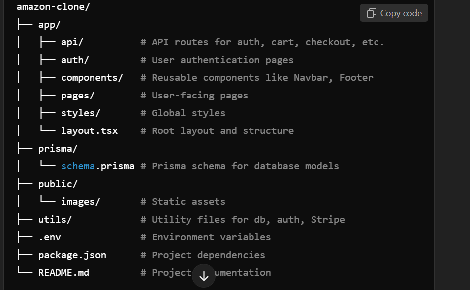

# Amazon Clone - Full-Stack E-commerce Application 🚀

This project is a full-stack Amazon-like e-commerce application built using Next.js 15, with a focus on mastering modern web development technologies. The application replicates core features of a real-world e-commerce platform, providing an end-to-end shopping experience, including user authentication, product browsing, cart management, checkout, and payment integration.

## Features 🌟

### User Features

- User Authentication:
  - Secure sign-up, sign-in, and sign-out using NextAuth.js with credentials provider.
- Product Management:
  - Dynamic product listings, categories, and detailed product pages.
- Shopping Cart:
  - Add, update, and remove products from the cart.
- Checkout Process:
  - Secure checkout with payment integration using Stripe.
- Wishlist and Saved Items:
  - Save items for future purchase.
- Order Management:
  - Track orders and their statuses.

### Admin Features

- Manage product inventory, including adding, editing, and deleting products.
- View and manage orders and their statuses.
- Monitor sales and customer data (planned feature).

## Tech Stack 🛠️

| **Layer**       | **Technology**                     |
|------------------|------------------------------------|
| **Frontend**     | Next.js 15, React, Tailwind CSS    |
| **Backend**      | Next.js API Routes (App Router)    |
| **Database**     | PostgreSQL, Prisma ORM            |
| **Authentication** | NextAuth.js                     |
| **Payments**     | Stripe                            |
| **DevOps**       | Docker, GitHub Actions            |

---

## Project Structure 📂

## How to Run Locally

1. Clone this repository:
`https://github.com/kelomo2502/NextJS15-Ecommerce-Website.git`
2. Navigate to the project directory
`cd NextJS15-Ecommerce-Website`
3. Install dependencies:
`npm install`
4. Set up environment variables: Create a .env file in the root with the following keys:
STRIPE_SECRET_KEY=add_your_stripe_secret
DATABASE_URL=Add_your_database_url
JWT_SECRET=Add_your_jwt_secret
5. Apply Prisma migrations to set up the database:
`npx prisma migrate dev`
6. Run the development server:
`npm run dev`
7. Access the app at <http://localhost:3000>

## Planned Improvements

- Add product reviews and ratings.
- Implement search and filtering functionality.
- Improve mobile responsiveness.
- Add advanced analytics for the admin panel.

## Usage 🖱️

### User Features

1. Sign Up / Log In: Navigate to /auth/register or /auth/login to create an account or log in.
2. Browse Products: Explore products on the homepage or search by category.
3. Manage Cart: Add products to the cart and proceed to checkout.
4. Wishlist: Save products for later.
5. Checkout: Complete your purchase with Stripe integration.

### Admin Features

1. Visit /admin for the admin panel (work in progress).

## Deployment 🚀

Comming soon

## Contributing 🤝

Contributions are welcome! Please follow these steps:

- Fork the repository.
- Create a new branch (git checkout -b feature/YourFeature).
- Commit your changes (git commit -m 'Add YourFeature').
- Push to the branch (git push origin feature/YourFeature).
- Open a pull request.

## Planned Features 🚧

- Product reviews and ratings.
- Search and filtering functionality.
- Admin analytics dashboard.
- Advanced mobile responsiveness.
- Push notifications for order updates.

## License 📜

This project is licensed under the [MIT License](LICENSE).

## Acknowledgements 🙌

- Next.js for the powerful framework.
- Prisma for database management.
- Stripe for payment processing.
- Tailwind CSS for styling.
- Inspired by the real-world functionality of Amazon.
